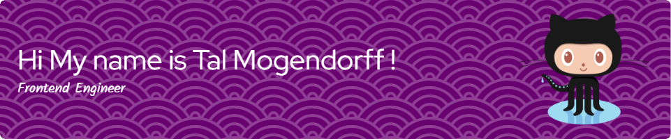

======================================================================================================================================
-----------------

I'm a passionate and dedicated Frontend Engineer fueled by a relentless curiosity for technology. With a creative mindset and a love for clean, user-centric design, specially in the UI UX world. \n
What Defines Me: 
Passion for Innovation: I thrive on exploring cutting-edge technologies and leveraging them to create intuitive, sleek, and impactful frontend solutions.
User-Centric Approach: My work is rooted in understanding user behavior, ensuring seamless interactions, and delivering an exceptional user experience.
Collaborative Spirit: I believe in the power of teamwork and collaboration. I enjoy working alongside diverse teams, exchanging ideas, and collectively turning concepts into reality

* 🌍  I'm based in Israel
* ✉️  You can contact me at [talorious12@gmail.com](mailto:talorious12@gmail.com)
* 🚀  I'm currently working on [Kubiya.AI](http://kubiya.ai)
* 🤝  I'm open to collaborating on Innovative Projects
* ⚡  Im a Surfer, Dad of a cute Dog, love 4x4 trips.

### Skills

### Socials

 <a href="https://discord.com/users/Talorious" target="_blank" rel="noreferrer"> <picture> <source media="(prefers-color-scheme: dark)" srcset="undefined" /> <source media="(prefers-color-scheme: light)" srcset="https://raw.githubusercontent.com/danielcranney/readme-generator/main/public/icons/socials/discord.svg" />  </picture> </a> <a href="https://www.facebook.com/Tal.BBoyTotal" target="_blank" rel="noreferrer"> <picture> <source media="(prefers-color-scheme: dark)" srcset="https://raw.githubusercontent.com/danielcranney/readme-generator/main/public/icons/socials/facebook-dark.svg" /> <source media="(prefers-color-scheme: light)" srcset="https://raw.githubusercontent.com/danielcranney/readme-generator/main/public/icons/socials/facebook.svg" />  </picture> </a> <a href="https://www.github.com/TalMogendorff" target="_blank" rel="noreferrer"> <picture> <source media="(prefers-color-scheme: dark)" srcset="https://raw.githubusercontent.com/danielcranney/readme-generator/main/public/icons/socials/github-dark.svg" /> <source media="(prefers-color-scheme: light)" srcset="https://raw.githubusercontent.com/danielcranney/readme-generator/main/public/icons/socials/github.svg" />  </picture> </a> <a href="http://www.instagram.com/tal.mogendorff" target="_blank" rel="noreferrer"> <picture> <source media="(prefers-color-scheme: dark)" srcset="undefined" /> <source media="(prefers-color-scheme: light)" srcset="https://raw.githubusercontent.com/danielcranney/readme-generator/main/public/icons/socials/instagram.svg" />  </picture> </a> <a href="https://www.linkedin.com/in/tal-mogendorff-5256991b5/" target="_blank" rel="noreferrer"> <picture> <source media="(prefers-color-scheme: dark)" srcset="https://raw.githubusercontent.com/danielcranney/readme-generator/main/public/icons/socials/linkedin-dark.svg" /> <source media="(prefers-color-scheme: light)" srcset="https://raw.githubusercontent.com/danielcranney/readme-generator/main/public/icons/socials/linkedin.svg" />  </picture> </a> <a href="https://www.stackoverflow.com/users/19738746/tal-mogendorff" target="_blank" rel="noreferrer"> <picture> <source media="(prefers-color-scheme: dark)" srcset="undefined" /> <source media="(prefers-color-scheme: light)" srcset="https://raw.githubusercontent.com/danielcranney/readme-generator/main/public/icons/socials/stackoverflow.svg" />  </picture> </a>

### Badges

